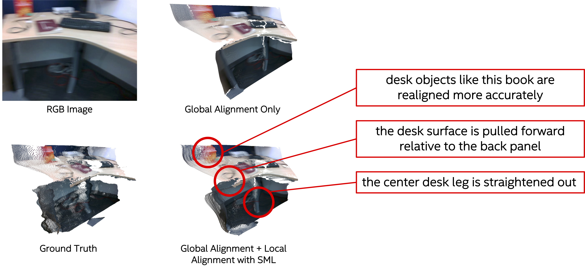

# Monocular Visual-Inertial Depth Estimation

This repository contains code and models for our paper:

> [Monocular Visual-Inertial Depth Estimation](https://arxiv.org/abs/2303.12134)  
> Diana Wofk, René Ranftl, Matthias Müller, Vladlen Koltun

## Introduction


We present a visual-inertial depth estimation pipeline that integrates monocular depth estimation and visual-inertial odometry to produce dense depth estimates with metric scale. Our approach consists of three stages: (1) input processing, where RGB and IMU data feed into monocular depth estimation alongside visual-inertial odometry, (2) global scale and shift alignment, where monocular depth estimates are fitted to sparse depth from VIO in a least-squares manner, and (3) learning-based dense scale alignment, where globally-aligned depth is locally realigned using a dense scale map regressed by the ScaleMapLearner (SML). The images at the bottom in the diagram above illustrate a VOID sample being processed through our pipeline; from left to right: the input RGB, ground truth depth, sparse depth from VIO, globally-aligned depth, scale map scaffolding, dense scale map regressed by SML, final depth output.



## Setup

1) Setup dependencies:

    ```shell
    conda env create -f environment.yaml
    conda activate vi-depth
    ```

2) Pick one or more ScaleMapLearner (SML) models and download the corresponding weights to the `weights` folder.

    | Depth Predictor   |  SML on VOID 150  |  SML on VOID 500  | SML on VOID 1500 |
    | :---              |       :----:      |       :----:      |      :----:      |
    | DPT-BEiT-Large    | [model](https://github.com/isl-org/VI-Depth/releases/download/v1/sml_model.dpredictor.dpt_beit_large_512.nsamples.150.ckpt) | [model](https://github.com/isl-org/VI-Depth/releases/download/v1/sml_model.dpredictor.dpt_beit_large_512.nsamples.500.ckpt) | [model](https://github.com/isl-org/VI-Depth/releases/download/v1/sml_model.dpredictor.dpt_beit_large_512.nsamples.1500.ckpt) |
    | DPT-SwinV2-Large  | [model](https://github.com/isl-org/VI-Depth/releases/download/v1/sml_model.dpredictor.dpt_swin2_large_384.nsamples.150.ckpt) | [model](https://github.com/isl-org/VI-Depth/releases/download/v1/sml_model.dpredictor.dpt_swin2_large_384.nsamples.500.ckpt) | [model](https://github.com/isl-org/VI-Depth/releases/download/v1/sml_model.dpredictor.dpt_swin2_large_384.nsamples.1500.ckpt) |
    | DPT-Large         | [model](https://github.com/isl-org/VI-Depth/releases/download/v1/sml_model.dpredictor.dpt_large.nsamples.150.ckpt) | [model](https://github.com/isl-org/VI-Depth/releases/download/v1/sml_model.dpredictor.dpt_large.nsamples.500.ckpt) | [model](https://github.com/isl-org/VI-Depth/releases/download/v1/sml_model.dpredictor.dpt_large.nsamples.1500.ckpt) |
    | DPT-Hybrid        | [model](https://github.com/isl-org/VI-Depth/releases/download/v1/sml_model.dpredictor.dpt_hybrid.nsamples.150.ckpt)* | [model](https://github.com/isl-org/VI-Depth/releases/download/v1/sml_model.dpredictor.dpt_hybrid.nsamples.500.ckpt) | [model](https://github.com/isl-org/VI-Depth/releases/download/v1/sml_model.dpredictor.dpt_hybrid.nsamples.1500.ckpt) |
    | DPT-SwinV2-Tiny   | [model](https://github.com/isl-org/VI-Depth/releases/download/v1/sml_model.dpredictor.dpt_swin2_tiny_256.nsamples.150.ckpt) | [model](https://github.com/isl-org/VI-Depth/releases/download/v1/sml_model.dpredictor.dpt_swin2_tiny_256.nsamples.500.ckpt) | [model](https://github.com/isl-org/VI-Depth/releases/download/v1/sml_model.dpredictor.dpt_swin2_tiny_256.nsamples.1500.ckpt) |
    | DPT-LeViT         | [model](https://github.com/isl-org/VI-Depth/releases/download/v1/sml_model.dpredictor.dpt_levit_224.nsamples.150.ckpt) | [model](https://github.com/isl-org/VI-Depth/releases/download/v1/sml_model.dpredictor.dpt_levit_224.nsamples.500.ckpt) | [model](https://github.com/isl-org/VI-Depth/releases/download/v1/sml_model.dpredictor.dpt_levit_224.nsamples.1500.ckpt) |
    | MiDaS-small       | [model](https://github.com/isl-org/VI-Depth/releases/download/v1/sml_model.dpredictor.midas_small.nsamples.150.ckpt) | [model](https://github.com/isl-org/VI-Depth/releases/download/v1/sml_model.dpredictor.midas_small.nsamples.500.ckpt) | [model](https://github.com/isl-org/VI-Depth/releases/download/v1/sml_model.dpredictor.midas_small.nsamples.1500.ckpt) |

    *Also available with pretraining on TartanAir: [model](https://github.com/isl-org/VI-Depth/releases/download/v1/sml_model.dpredictor.dpt_hybrid.nsamples.150.pretrained.ckpt)

## Inference

1) Place inputs into the `input` folder. An input image and corresponding sparse metric depth map are expected:

    ```bash
    input
    ├── image                   # RGB image
    │   ├── <timestamp>.png
    │   └── ...
    └── sparse_depth            # sparse metric depth map
        ├── <timestamp>.png     # as 16b PNG
        └── ...
    ```

    The `load_sparse_depth` function in `run.py` may need to be modified depending on the format in which sparse depth is stored. By default, the depth storage method [used in the VOID dataset](https://github.com/alexklwong/void-dataset/blob/master/src/data_utils.py) is assumed.

2) Run the `run.py` script as follows:

    ```bash
    DEPTH_PREDICTOR="dpt_beit_large_512"
    NSAMPLES=150
    SML_MODEL_PATH="weights/sml_model.dpredictor.${DEPTH_PREDICTOR}.nsamples.${NSAMPLES}.ckpt"

    python run.py -dp $DEPTH_PREDICTOR -ns $NSAMPLES -sm $SML_MODEL_PATH --save-output
    ```

3) The `--save-output` flag enables saving outputs to the `output` folder. By default, the following outputs will be saved per sample:

    ```bash
    output
    ├── ga_depth                # metric depth map after global alignment
    │   ├── <timestamp>.pfm     # as PFM
    │   ├── <timestamp>.png     # as 16b PNG
    │   └── ...
    └── sml_depth               # metric depth map output by SML
        ├── <timestamp>.pfm     # as PFM
        ├── <timestamp>.png     # as 16b PNG
        └── ...
    ```

## Evaluation

Models provided in this repo were trained on the VOID dataset. 
1) Download the VOID dataset following [the instructions in the VOID dataset repo](https://github.com/alexklwong/void-dataset#downloading-void).
2) To evaluate on VOID test sets, run the `evaluate.py` script as follows:

    ```bash
    DATASET_PATH="/path/to/void_release/"

    DEPTH_PREDICTOR="dpt_beit_large_512"
    NSAMPLES=150
    SML_MODEL_PATH="weights/sml_model.dpredictor.${DEPTH_PREDICTOR}.nsamples.${NSAMPLES}.ckpt"

    python evaluate.py -ds $DATASET_PATH -dp $DEPTH_PREDICTOR -ns $NSAMPLES -sm $SML_MODEL_PATH
    ```

    Results for the example shown above:

    ```
    Averaging metrics for globally-aligned depth over 800 samples
    Averaging metrics for SML-aligned depth over 800 samples
    +---------+----------+----------+
    |  metric | GA Only  |  GA+SML  |
    +---------+----------+----------+
    |   RMSE  |  191.36  |  142.85  |
    |   MAE   |  115.84  |   76.95  |
    |  AbsRel |    0.069 |    0.046 |
    |  iRMSE  |   72.70  |   57.13  |
    |   iMAE  |   49.32  |   34.25  |
    | iAbsRel |    0.071 |    0.048 |
    +---------+----------+----------+
    ```
    
    To evaluate on VOID test sets at different densities (void_150, void_500, void_1500), change the `NSAMPLES` argument above accordingly.

## Citation

If you reference our work, please consider citing the following:

```bib
@inproceedings{wofk2023videpth,
    author      = {{Wofk, Diana and Ranftl, Ren\'{e} and M{\"u}ller, Matthias and Koltun, Vladlen}},
    title       = {{Monocular Visual-Inertial Depth Estimation}},
    booktitle   = {{IEEE International Conference on Robotics and Automation (ICRA)}},
    year        = {{2023}}
}
```

## Acknowledgements

Our work builds on and uses code from [MiDaS](https://github.com/isl-org/MiDaS), [timm](https://github.com/rwightman/pytorch-image-models), and [PyTorch Lightning](https://lightning.ai/docs/pytorch/stable/). We'd like to thank the authors for making these libraries and frameworks available.

